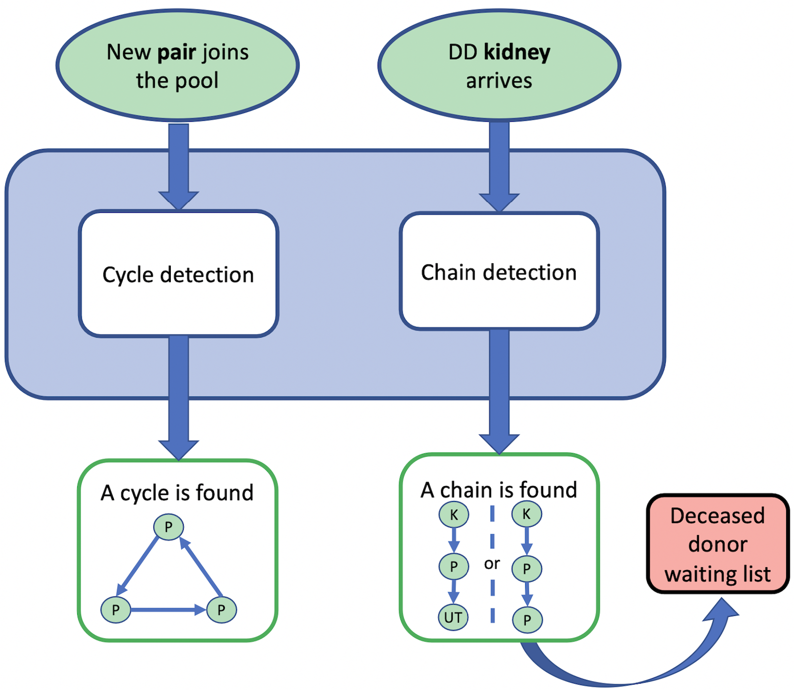

## ✨ Welcome to my website! 
I'm **Cristina Cornelio**, Research Scientist at Samsung AI in Cambridge (UK). 
* <a href="https://corneliocristina.github.io/about.html" style="display: inline" > 👤 About me</a> &larr; If you want to find out more about me.
* <a href="https://corneliocristina.github.io/publications.html" style="display: inline" class="button"> 📖 Publications & 💻 Projects</a> &larr; If you want to know more about my work.

## Selected Projects

<table>
   <tr>
      <td>
            
  
 
            <h3 align="center" > AI-Descartes </h3>
         
  &rarr; <a href="https://ai-descartes.github.io/"> Visit the website </a> &larr; 

            <ul>
               <li> A novel combination of reasoning and machine learning for an automated scientific discovery pipeline. </li>
               <li> Published in Nature Communications. </li>
            </ul> 
      </td>
      <td> </td>
      <td> 
            
  
 
            <h3 align="center"> DECK </h3>
            
 &rarr; <a href="https://corneliocristina.github.io/DECK.html"> Visit the webpage </a> &larr; 

            <ul>
               <li> A new algorithm for using deceased-donor kidneys to initiate chains of living donor kidney paired donations. </li>
               <li> Currently used nationally in Italy. </li>
         </ul>
      </td>
   </tr>
</table>

## News 

* **January 2023** - "Combining data and theory for derivable scientific discovery with AI-Descartes" published in *Nature Communacations*
* **January 2023** - "Learning where and when to reason in neuro-symbolic inference" accepted as *notable-top-5%* at ICLR 2023
* **January 2023** - Invited talk "Derivable Scientific Discovery" at the IBM Neuro-Symbolic AI Workshop
