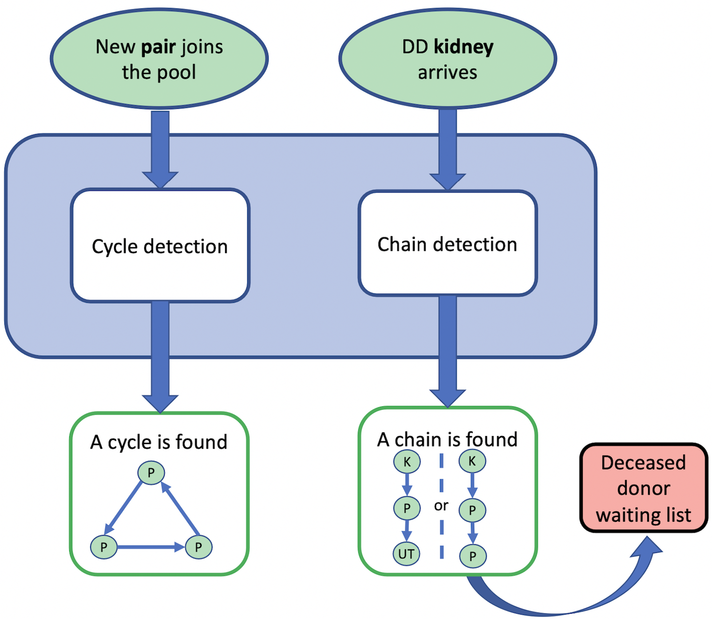

## ✨ Welcome to my website! 
I'm **Cristina Cornelio**, Research Scientist at Samsung AI in Cambridge (UK). 
* <a href="https://corneliocristina.github.io/about.html" style="display: inline" > 👤 About me</a> &larr; If you want to find out more about me.
* <a href="https://corneliocristina.github.io/publications.html" style="display: inline" class="button"> 📖 Publications & 💻 Projects</a> &larr; If you want to know more about my work.

## Selected Projects

<table border="1">
   <tr>
      <td> 
 <b> AI-Descartes </b> 
 </td>
      <td> </td>
      <td> 
 <b> DECK </b> 
 </td>
   </tr>
   <tr>
      <td> 
 a pipeline for Automated Scientific Discovery 
 </td>
      <td> </td>
      <td> 
 DECeased Kidney cross-over program 
 </td>
   </tr>
   <tr>
      <td>  </td>
      <td> </td>
      <td>  </td>
   </tr>
   <tr>
      <td> 
         <ul>
            <li> A novel combination of reasoning and machine learning for a automated scientific discovery pipeline. </li>
         </ul>
      </td>
      <td> </td>
      <td> 
         <ul>
            <li> A new algorithm for using deceased-donor kidneys to initiate chains of living donor kidney paired donations. </li>
            <li> Currently used nationally in Italy </li>
         </ul>
      </td>
   </tr>   
   <tr>
      <td> 
 :arrow_right: <a href="https://ai-descartes.github.io/"> AI-Descarted website </a> :arrow_left:
 </td>
      <td> </td>
      <td> 
 &rarr; <a href="https://corneliocristina.github.io/DECK.html"> DECK webpage </a> &larr; 
 </td>
   </tr>
</table>

## News 

* **January 2023** - "Learning where and when to reason in neuro-symbolic inference" accepted as *notable-top-5%* at ICLR 2023
* **January 2023** - Invited talk "Derivable Scientific Discovery" at the IBM Neuro-Symbolic AI Workshop
* **November 2022** - Invited talk "Derivable Scientific Discovery" at the 2nd Workshop on Nobel Turing Challenge
